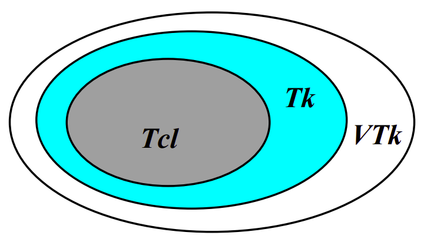

# minicurso-Vtk-Itk


## O que é Vtk
- **Tcl** é uma linguagem de comandos (Tool Command Language - pronúncia
“tickle”)
- **Tk** é um ‘ToolKit’ para o sistema X (Unix), Windows, etc., e ele aumenta o núcleo de facilidades da Tcl com comandos para construir interfaces
- **VTk** é um Toolkit para Visualização, ou seja, é uma biblioteca de rotinas que executa
funções gráficas e de visualização



## Como instalar as ferramentas

### No Linux
Tcl
  ```bash
  sudo apt install tcl
  ```

Tk
  ```bash
    sudo apt install tk
  ```
<!-- 
VTk
```bash
    sudo apt install cmake libavcodec-dev libavformat-dev libavutil-dev libboost-dev libdouble-conversion-dev libeigen3-dev libexpat1-dev libfontconfig-dev libfreetype6-dev libgdal-dev libglew-dev libhdf5-dev libjpeg-dev libjsoncpp-dev liblz4-dev liblzma-dev libnetcdf-dev libnetcdf-cxx-legacy-dev libogg-dev libpng-dev libpython3-dev libqt5opengl5-dev libqt5x11extras5-dev libsqlite3-dev libswscale-dev libtheora-dev libtiff-dev libxml2-dev libxt-dev qtbase5-dev qttools5-dev zlib1g-dev
    git clone git@gitlab.kitware.com:vtk/vtk.git
    cd vtk
    git checkout v8.2.0
    mkdir build
    cd build
    cmake -DCMAKE_INSTALL_PREFIX=$HOME/vtk-inst \
    -DCMAKE_INSTALL_RPATH=$HOME/vtk-inst \
    -DVTK_Group_Qt=ON \
    -DVTK_QT_VERSION=5 \
    -DVTK_Group_Imaging=ON \
    -DVTK_Group_Views=ON \
    -DModule_vtkRenderingFreeTypeFontConfig=ON \
    -DVTK_WRAP_PYTHON=ON \
    -DVTK_PYTHON_VERSION=3 \
    -DPYTHON_EXECUTABLE=/usr/bin/python3 \
    -DPYTHON_INCLUDE_DIR=/usr/include/python3.6 \
    -DPYTHON_LIBRARY=/usr/lib/x86_64-linux-gnu/libpython3.6m.so \
    -DBUILD_TESTING=OFF \
    -DVTK_USE_SYSTEM_LIBRARIES=ON \
    -DVTK_USE_SYSTEM_LIBPROJ4=OFF \
    -DVTK_USE_SYSTEM_GL2PS=OFF \
    -DVTK_USE_SYSTEM_LIBHARU=OFF \
    -DVTK_USE_SYSTEM_PUGIXML=OFF \
    -DCMAKE_BUILD_TYPE=Release \
    ..
    make -j$(($(nproc) - 1))
    make install
``` -->

## Como Executar
 Para execurat é necessario ter um shell
 - tclsh (Unix)
 - wish (Windows)


 Criar um arquivo .tcl com os comando e dentro do shell executar
   ```shell
  source nome_do_arquivo.tcl
  ```